# 🏎️ F1 Data Analysis Dashboard

Proyecto de análisis y visualización de datos de Fórmula 1 orientado a comparar el rendimiento de pilotos y equipos mediante dashboards interactivos.

---

## 📌 Descripción

Este proyecto tiene como objetivo desarrollar una solución que permita recopilar, transformar y visualizar datos de Fórmula 1 de forma clara y estructurada.

A partir de diferentes fuentes de datos, se construye un sistema que facilita el análisis del rendimiento de pilotos, resultados de carrera y métricas clave mediante visualizaciones intuitivas.

---

## 🎯 Objetivos

- Obtener datos de Fórmula 1 desde APIs y datasets.
- Procesar y limpiar la información.
- Diseñar un modelo de datos estructurado.
- Crear dashboards interactivos.
- Facilitar la comparación entre pilotos y equipos.

---

## ⚙️ Tecnologías utilizadas

## Lenguajes y herramientas

- Python
- SQL
- Docker

## Librerías utilizadas

- pandas
- requests
- psycopg2

## Base de datos

- PostgreSQL

## Visualización

- Grafana

## Fuente de datos

- OpenF1 API

---

# 🔌 API utilizada: OpenF1

El proyecto utiliza OpenF1 como fuente principal de datos de Fórmula 1. (https://openf1.org/)

OpenF1 es una API pública que proporciona información relacionada con:

- Pilotos
- Resultados
- Posiciones
- Tiempos por vuelta
- Pit stops
- Stints
- Sesiones
- Equipos

La API devuelve la información en formato JSON mediante peticiones HTTP realizadas desde Python.

---

## 📡 Endpoints utilizados

| Endpoint | Descripción |
|---|---|
| `/drivers` | Información de pilotos |
| `/sessions` | Información de sesiones |
| `/laps` | Datos de vueltas |
| `/position` | Posiciones durante carrera |
| `/pit` | Información de pit stops |
| `/stints` | Información de neumáticos y stints |
| `/results` | Resultados finales |

---

## 🧪 Ejemplo de petición

```python
import requests

url = "https://api.openf1.org/v1/drivers?session_key=9472"

response = requests.get(url)

data = response.json()

print(data[:1])
```

---

## 📄 Ejemplo de respuesta JSON

```json
[
  {
    "broadcast_name": "M VERSTAPPEN",
    "country_code": "NED",
    "driver_number": 1,
    "first_name": "Max",
    "full_name": "Max Verstappen",
    "headshot_url": "https://media.formula1.com/image/upload/f_auto,c_limit,q_auto,w_1320/content/dam/fom-website/drivers/2024Drivers/verstappen",
    "last_name": "Verstappen",
    "meeting_key": 1219,
    "name_acronym": "VER",
    "session_key": 9472,
    "team_colour": "3671C6",
    "team_name": "Red Bull Racing"
  }
]
```

---

## 🗄️ Modelo de datos

El sistema se basa en una estructura que incluye:

- Pilotos
- Equipos
- Resultados
- Tiempos por vuelta

---

## 📸 Todas las visualizaciones con sus respectivas consultas SQL

### Primer dashboard
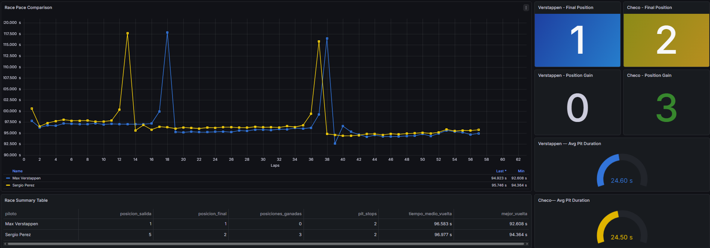

---

### Race Pace Comparison
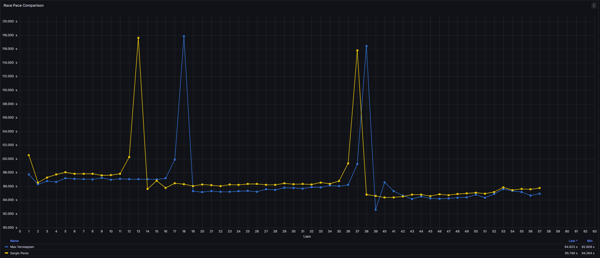

```
SELECT
  lap_number,
  lap_duration AS "Max Verstappen"
FROM fact_lap
WHERE session_key = 9472
  AND driver_number = 1
ORDER BY lap_number;
```

```
SELECT
  lap_number,
  lap_duration AS "Sergio Perez"
FROM fact_lap
WHERE session_key = 9472
  AND driver_number = 11
ORDER BY lap_number;
```

---

### Final Position
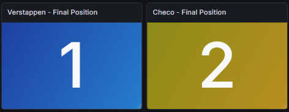

```
SELECT position
FROM fact_result
WHERE session_key = 9472
  AND driver_number = 1;
```

```
SELECT position
FROM fact_result
WHERE session_key = 9472
  AND driver_number = 11;
```

---

### Position Gain
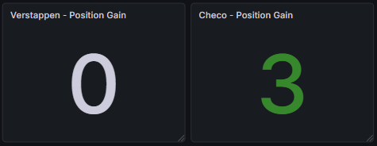

```
SELECT (g.grid_position - r.position) AS posiciones_ganadas
FROM fact_result r
JOIN fact_grid g
  ON g.session_key = r.session_key
 AND g.driver_number = r.driver_number
WHERE r.session_key = 9472
  AND r.driver_number = 1;
```

```
SELECT (g.grid_position - r.position) AS posiciones_ganadas
FROM fact_result r
JOIN fact_grid g
  ON g.session_key = r.session_key
 AND g.driver_number = r.driver_number
WHERE r.session_key = 9472
  AND r.driver_number = 11;
```

---

### Avg Pit Duration
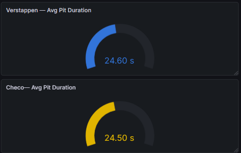

```
SELECT ROUND(AVG(lane_duration)::numeric, 3) AS avg_pit_duration
FROM fact_pit
WHERE session_key = 9472
  AND driver_number = 1;
```

```
SELECT ROUND(AVG(lane_duration)::numeric, 3) AS avg_pit_duration
FROM fact_pit
WHERE session_key = 9472
  AND driver_number = 11;
```

---

### Race Summary Table
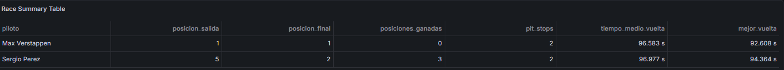

```
SELECT
  CASE
    WHEN r.driver_number = 1 THEN 'Max Verstappen'
    WHEN r.driver_number = 11 THEN 'Sergio Perez'
  END AS piloto,
  g.grid_position AS posicion_salida,
  r.position AS posicion_final,
  (g.grid_position - r.position) AS posiciones_ganadas,
  COALESCE(p.num_pit_stops, 0) AS pit_stops,
  ROUND(l.avg_lap_time::numeric, 3) AS tiempo_medio_vuelta,
  ROUND(l.best_lap_time::numeric, 3) AS mejor_vuelta
FROM fact_result r
JOIN fact_grid g
  ON g.session_key = r.session_key
 AND g.driver_number = r.driver_number
LEFT JOIN (
  SELECT
    session_key,
    driver_number,
    COUNT(*) AS num_pit_stops
  FROM fact_pit
  WHERE session_key = 9472
  GROUP BY session_key, driver_number
) p
  ON p.session_key = r.session_key
 AND p.driver_number = r.driver_number
LEFT JOIN (
  SELECT
    session_key,
    driver_number,
    AVG(lap_duration) AS avg_lap_time,
    MIN(lap_duration) AS best_lap_time
  FROM fact_lap
  WHERE session_key = 9472
  GROUP BY session_key, driver_number
) l
  ON l.session_key = r.session_key
 AND l.driver_number = r.driver_number
WHERE r.session_key = 9472
  AND r.driver_number IN (1, 11)
ORDER BY r.position;
```

---

### Segundo Dashboard
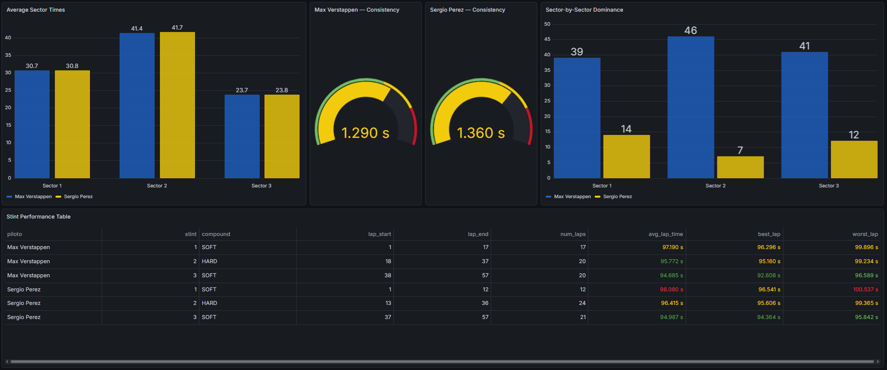

---

### Average Sector Times
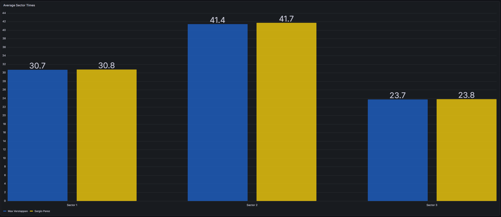

```
SELECT
  sector,
  MAX(CASE WHEN piloto = 'Max Verstappen' THEN avg_time END) AS "Max Verstappen",
  MAX(CASE WHEN piloto = 'Sergio Perez' THEN avg_time END) AS "Sergio Perez"
FROM (
  SELECT
    sector,
    piloto,
    avg_time
  FROM (
    SELECT
      CASE
        WHEN driver_number = 1 THEN 'Max Verstappen'
        WHEN driver_number = 11 THEN 'Sergio Perez'
      END AS piloto,
      ROUND(AVG(duration_sector_1)::numeric, 3) AS s1,
      ROUND(AVG(duration_sector_2)::numeric, 3) AS s2,
      ROUND(AVG(duration_sector_3)::numeric, 3) AS s3
    FROM fact_lap
    WHERE session_key = 9472
      AND driver_number IN (1, 11)
      AND duration_sector_1 IS NOT NULL
      AND duration_sector_2 IS NOT NULL
      AND duration_sector_3 IS NOT NULL
      AND COALESCE(is_pit_out_lap, false) = false
    GROUP BY driver_number
  ) t
  CROSS JOIN LATERAL (
    VALUES
      ('Sector 1', s1),
      ('Sector 2', s2),
      ('Sector 3', s3)
  ) v(sector, avg_time)
) q
GROUP BY sector
ORDER BY sector;

```

---

### Consistency
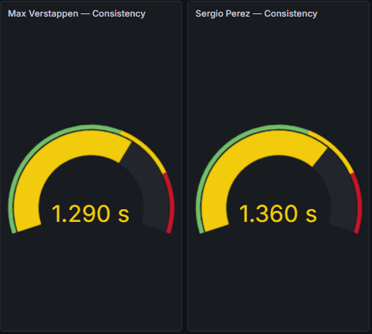

```
SELECT
  ROUND(STDDEV_POP(lap_duration)::numeric, 3) AS consistency
FROM fact_lap
WHERE session_key = 9472
  AND driver_number = 1
  AND lap_duration IS NOT NULL
  AND COALESCE(is_pit_out_lap, false) = false;
```

```
SELECT
  ROUND(STDDEV_POP(lap_duration)::numeric, 3) AS consistency
FROM fact_lap
WHERE session_key = 9472
  AND driver_number = 11
  AND lap_duration IS NOT NULL
  AND COALESCE(is_pit_out_lap, false) = false;
```

---

### Sector by Sector Dominance
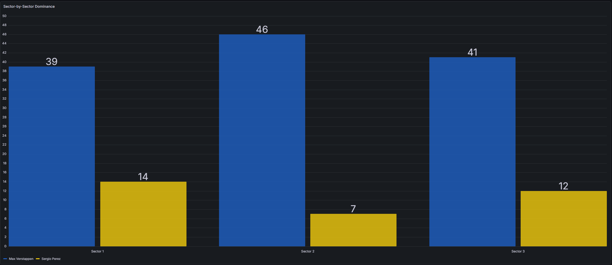

```
SELECT
  sector,
  MAX(CASE WHEN piloto = 'Max Verstappen' THEN wins END) AS "Max Verstappen",
  MAX(CASE WHEN piloto = 'Sergio Perez' THEN wins END) AS "Sergio Perez"
FROM (
  SELECT
    sector,
    piloto,
    COUNT(*) AS wins
  FROM (
    SELECT
      'Sector 1' AS sector,
      CASE
        WHEN l1.duration_sector_1 < l2.duration_sector_1 THEN 'Max Verstappen'
        ELSE 'Sergio Perez'
      END AS piloto
    FROM fact_lap l1
    JOIN fact_lap l2
      ON l1.session_key = l2.session_key
     AND l1.lap_number = l2.lap_number
    WHERE l1.session_key = 9472
      AND l1.driver_number = 1
      AND l2.driver_number = 11
      AND l1.duration_sector_1 IS NOT NULL
      AND l2.duration_sector_1 IS NOT NULL
      AND COALESCE(l1.is_pit_out_lap, false) = false
      AND COALESCE(l2.is_pit_out_lap, false) = false

    UNION ALL

    SELECT
      'Sector 2' AS sector,
      CASE
        WHEN l1.duration_sector_2 < l2.duration_sector_2 THEN 'Max Verstappen'
        ELSE 'Sergio Perez'
      END AS piloto
    FROM fact_lap l1
    JOIN fact_lap l2
      ON l1.session_key = l2.session_key
     AND l1.lap_number = l2.lap_number
    WHERE l1.session_key = 9472
      AND l1.driver_number = 1
      AND l2.driver_number = 11
      AND l1.duration_sector_2 IS NOT NULL
      AND l2.duration_sector_2 IS NOT NULL
      AND COALESCE(l1.is_pit_out_lap, false) = false
      AND COALESCE(l2.is_pit_out_lap, false) = false

    UNION ALL

    SELECT
      'Sector 3' AS sector,
      CASE
        WHEN l1.duration_sector_3 < l2.duration_sector_3 THEN 'Max Verstappen'
        ELSE 'Sergio Perez'
      END AS piloto
    FROM fact_lap l1
    JOIN fact_lap l2
      ON l1.session_key = l2.session_key
     AND l1.lap_number = l2.lap_number
    WHERE l1.session_key = 9472
      AND l1.driver_number = 1
      AND l2.driver_number = 11
      AND l1.duration_sector_3 IS NOT NULL
      AND l2.duration_sector_3 IS NOT NULL
      AND COALESCE(l1.is_pit_out_lap, false) = false
      AND COALESCE(l2.is_pit_out_lap, false) = false
  ) t
  GROUP BY sector, piloto
) q
GROUP BY sector
ORDER BY sector;
```

---

### Stint Performance Table
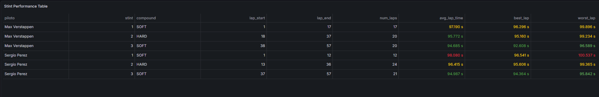

```
SELECT
  CASE
    WHEN s.driver_number = 1 THEN 'Max Verstappen'
    WHEN s.driver_number = 11 THEN 'Sergio Perez'
  END AS piloto,
  s.stint_number AS stint,
  s.compound,
  s.lap_start,
  s.lap_end,
  (s.lap_end - s.lap_start + 1) AS num_laps,
  ROUND(AVG(l.lap_duration)::numeric, 3) AS avg_lap_time,
  ROUND(MIN(l.lap_duration)::numeric, 3) AS best_lap,
  ROUND(MAX(l.lap_duration)::numeric, 3) AS worst_lap
FROM fact_stint s
JOIN fact_lap l
  ON l.session_key = s.session_key
 AND l.driver_number = s.driver_number
 AND l.lap_number BETWEEN s.lap_start AND s.lap_end
WHERE s.session_key = 9472
  AND s.driver_number IN (1, 11)
  AND l.lap_duration IS NOT NULL
  AND COALESCE(l.is_pit_out_lap, false) = false
GROUP BY s.driver_number, s.stint_number, s.compound, s.lap_start, s.lap_end
ORDER BY piloto, stint;
```

---

### Tercer Dashboard
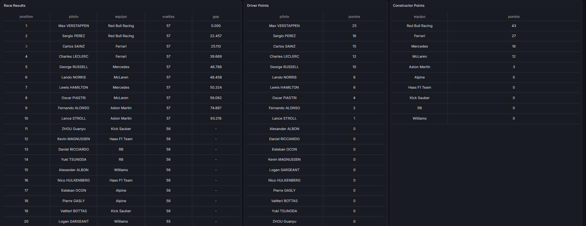

---

### Race Results
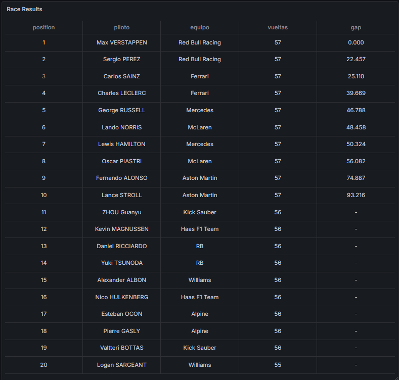

```
SELECT
  r.position,
  d.full_name AS piloto,
  d.team_name AS equipo,
  r.number_of_laps AS vueltas,
  CASE
    WHEN r.gap_to_leader IS NULL THEN '-'
    ELSE ROUND(r.gap_to_leader::numeric, 3)::text
  END AS gap
FROM fact_result r
JOIN dim_driver d
  ON d.session_key = r.session_key
 AND d.driver_number = r.driver_number
WHERE r.session_key = 9472
ORDER BY r.position;
```

---

### Driver Points
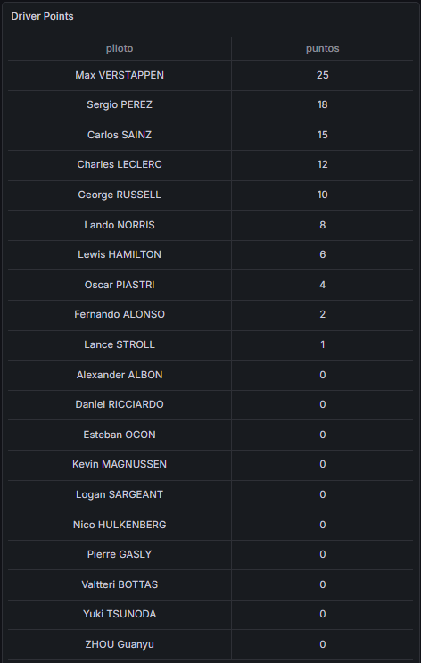

```
SELECT
  d.full_name AS piloto,
  CASE r.position
    WHEN 1 THEN 25
    WHEN 2 THEN 18
    WHEN 3 THEN 15
    WHEN 4 THEN 12
    WHEN 5 THEN 10
    WHEN 6 THEN 8
    WHEN 7 THEN 6
    WHEN 8 THEN 4
    WHEN 9 THEN 2
    WHEN 10 THEN 1
    ELSE 0
  END AS puntos
FROM fact_result r
JOIN dim_driver d
  ON d.session_key = r.session_key
 AND d.driver_number = r.driver_number
WHERE r.session_key = 9472
ORDER BY puntos DESC, piloto;
```

---

### Constructor Points
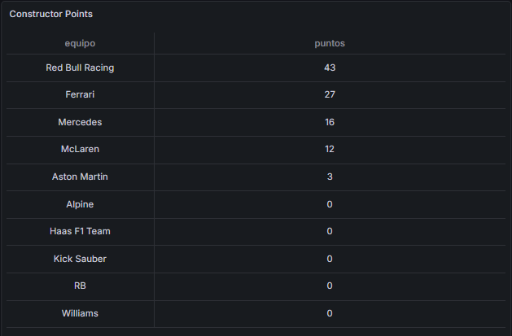

```
SELECT
  d.team_name AS equipo,
  SUM(
    CASE r.position
      WHEN 1 THEN 25
      WHEN 2 THEN 18
      WHEN 3 THEN 15
      WHEN 4 THEN 12
      WHEN 5 THEN 10
      WHEN 6 THEN 8
      WHEN 7 THEN 6
      WHEN 8 THEN 4
      WHEN 9 THEN 2
      WHEN 10 THEN 1
      ELSE 0
    END
  ) AS puntos
FROM fact_result r
JOIN dim_driver d
  ON d.session_key = r.session_key
 AND d.driver_number = r.driver_number
WHERE r.session_key = 9472
GROUP BY d.team_name
ORDER BY puntos DESC, equipo;
```

---

## 🔄 Metodología

El proyecto se ha desarrollado en varias fases:

1. Recopilación de datos  
2. Diseño del modelo  
3. Transformación de datos  
4. Desarrollo de visualizaciones  
5. Validación  

---

## 📈 Resultados

- Sistema funcional de análisis de datos de F1  
- Visualizaciones claras e intuitivas  
- Comparación de rendimiento entre pilotos  
- Base ampliable para futuros desarrollos  


