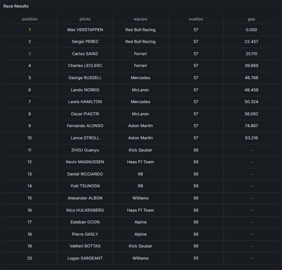
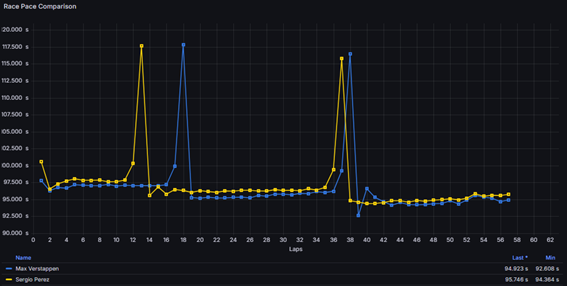

# 🏎️ F1 Data Analysis Dashboard

Proyecto de análisis y visualización de datos de Fórmula 1 orientado a comparar el rendimiento de pilotos y equipos mediante dashboards interactivos.

---

## 📌 Descripción

Este proyecto tiene como objetivo desarrollar una solución que permita recopilar, transformar y visualizar datos de Fórmula 1 de forma clara y estructurada.

A partir de diferentes fuentes de datos, se construye un sistema que facilita el análisis del rendimiento de pilotos, resultados de carrera y métricas clave mediante visualizaciones intuitivas.

---

## 🎯 Objetivos

- Obtener datos de Fórmula 1 desde APIs y datasets.
- Procesar y limpiar la información.
- Diseñar un modelo de datos estructurado.
- Crear dashboards interactivos.
- Facilitar la comparación entre pilotos y equipos.

---

## ⚙️ Tecnologías utilizadas

- Python  
- Pandas  
- APIs (OpenF1, FastF1)  
- Herramientas de visualización (Grafana / Dashboards)

---

## 🗄️ Modelo de datos

El sistema se basa en una estructura que incluye:

- Pilotos
- Equipos
- Resultados
- Tiempos por vuelta

---

## 📸 Ejemplos de visualizaciones

### 🏁 Dashboard de comparación de pilotos

---

### 📈 Análisis de tiempos por vuelta

---

### 📊 Tabla de datos procesados

---

## 🔄 Metodología

El proyecto se ha desarrollado en varias fases:

1. Recopilación de datos  
2. Diseño del modelo  
3. Transformación de datos  
4. Desarrollo de visualizaciones  
5. Validación  

---

## 📈 Resultados

- Sistema funcional de análisis de datos de F1  
- Visualizaciones claras e intuitivas  
- Comparación de rendimiento entre pilotos  
- Base ampliable para futuros desarrollos  

